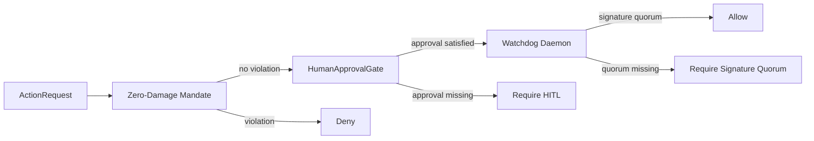

# Heritage Stack™ Zero-Damage Governance Architecture

## System architecture overview

The Heritage Stack™ layer is a governance kernel that sits before destructive,
external-facing, high-stakes, or system-state-transition actions. It is not an
autonomous command system. It evaluates proposed actions and returns an inspectable
decision: allow, require human approval, require Watchdog signature quorum, or deny
under the Zero-Damage Mandate.

## Human-in-the-loop control loop

High-stakes requests require explicit `ApprovalRecord` evidence. Approval records
are tied to a request id, approver id, rationale, approval boolean, and timestamp.
The kernel never manufactures approvals and never upgrades a pending action into an
executed action.

## Cryptographic integrity

Critical checks flow through `WatchdogDaemon`. The local verifier is explicitly a
deterministic SHA-256 test verifier. Production environments should replace it with
Ed25519 verification, hardware-backed keys, and multi-signature policy anchored in
sovereign key ownership.

## Zero-Damage Mandate

The mandate rejects requests that attempt to bypass human authority, override safety,
conceal objectives, merge protected datasets, centralize sovereign authority, or
issue binding operational commands. This keeps Heritage Stack behavior aligned with
AnnabanAI/AetherOS advisory-only governance.
