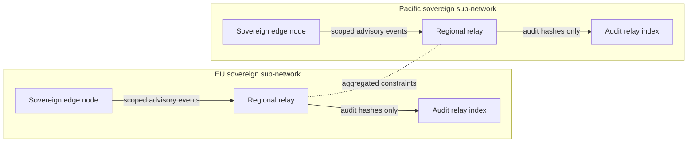

# AnnabanAI / AetherOS / AnnabanOS Federated Architecture Overview

## System architecture overview

Purpose: provide a federated situational-awareness mesh for maritime logistics, infrastructure resilience, healthcare logistics visibility, trade coordination, risk forecasting, and multi-agent decision support.

The stack is advisory-only. It does not issue binding operational commands, centralize sovereign authority, override human decision-making, or merge protected datasets across jurisdictions.

## Federated node model

- Sovereign edge nodes retain local data ownership and run local inference, simulation, audit, and dashboard services.
- Regional clusters support eventual consistency for scoped aggregate events.
- Audit relays index immutable event hashes and correlation IDs without storing protected raw payloads.
- Constraint graphs share aggregate stress relationships, not protected source records.

## Dashboard implementation

AetherOS uses a modular React dashboard with sovereign, coalition, emergency, and simulation-only modes. Widgets are intentionally decoupled from live APIs; gateways must provide scoped WebSocket streams after server-side authorization.

## Simulation engine

The tabletop simulation engine accepts synthetic geopolitical, port closure, fuel shock, healthcare crisis, and supply-chain events. Outputs are simulation-only resilience metrics and should remain separate from operational recommendation workflows unless explicitly reviewed.

## Governance and audit layer

Every recommendation includes rationale, confidence, affected constraints, projected tradeoffs, audit metadata, and human-review state. Policy replay is supported through append-only recommendation logs and scoped event replay.

## Security considerations

- Zero-trust networking and encrypted event transport.
- Federated identity and sovereign key ownership.
- Compartmentalized data access by jurisdiction and visibility scope.
- Inspectable optimization and no hidden objectives.
- Human approval required for all recommendations.
